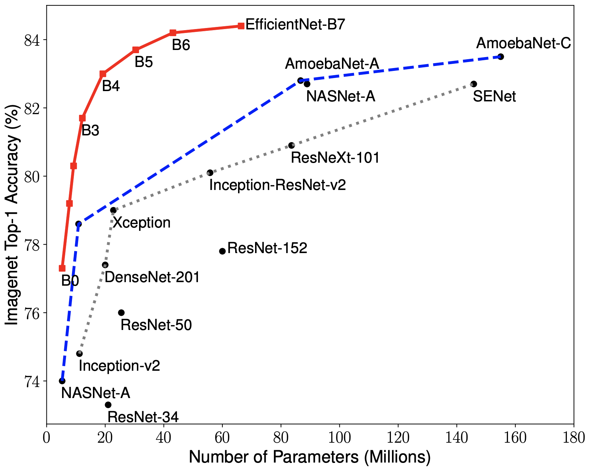

# Bengali AI

## Handwritten Grapheme Classification

#### Kaggle competition

#### HSE NN 2020

Mukhammet Nazirov

<!-- _paginate: false -->

---


# Architecture Overview

Platform: PyTorch

1. Backbone: EfficientNet v3 + Generalized mean pooling 2D
2. Classifiers: Dense layers -> Multioutput NN 

---

# Generalized mean pooling 2D

[TPU keras metric learning](https://www.kaggle.com/bamps53/private0-9704-tpu-keras-metric-learning) (Private Score:0.9704)


```python
class GeM(nn.Module):
    def __init__(self, p=3, eps=1e-6):
        super(GeM, self).__init__()
        self.p = p
        self.eps = eps
    
    def forward(self, x):
        return (torch.mean(torch.abs(x**self.p), dim=(2,3)) + self.eps)**(1.0/self.p)
```


---

# EfficientNet

>EfficientNets are a family of image classification models, which achieve state-of-the-art accuracy. We develop EfficientNets based on AutoML... 


 

---

# PyTorch EfficientNet

A PyTorch implementation of EfficientNet: 
https://github.com/lukemelas/EfficientNet-PyTorch


>At the moment, you can easily:
>- Load pretrained EfficientNet models (ImageNet)
>- Use EfficientNet models for classification or feature extraction
>- Evaluate EfficientNet models on ImageNet or your own images

>Upcoming features: In the next few days, you will be able to:
>- Train new models from scratch on ImageNet with a simple command
>- **Quickly finetune an EfficientNet on your own dataset**
>- Export EfficientNet models for production


---


# Finetuning EfficientNet

```python
def load_pretrained_weights(model, model_name, load_fc=True, advprop=False, in_channels=3):
    """ Loads pretrained weights, and downloads if loading for the first time. """
    ...
    state_dict = model_zoo.load_url(url_map_[model_name])
    if load_fc:
        if in_channels == 1:
            conv1_weight = state_dict['_conv_stem.weight']
            state_dict['_conv_stem.weight'] = conv1_weight.sum(dim=1, keepdim=True)
        model.load_state_dict(state_dict)
    ...
```
```python
class EffNetTuned(nn.Module):
    def __init__(self):
        super(EffNetTuned, self).__init__()
        self.eff = EfficientNet.from_pretrained('backbone-b3', in_channel=1)
        self.eff._avg_pooling = GeM()
        self.eff._dropout = nn.Dropout(p=0.2, inplace=False)
        self.fc = nn.Sequential(
            nn.Linear(in_features=1000, out_features=512),
            nn.BatchNorm1d(512)
        ) 
    def forward(self, x):
        x = self.eff(x)
        x = self.fc(x)
        return x                                                                                    
``` 

---

# Model

```python
class EffMultioutputNet(nn.Module):
    def __init__(self):
        super(EffMultioutputNet, self).__init__()
        self.backbone = EffNetTuned()
        self.rootClassifier = nn.Linear(in_features=512, out_features=168)
        self.vowelClassifier = nn.Linear(in_features=512, out_features=11)
        self.consonantClassifier = nn.Linear(in_features=512, out_features=7)

    def forward(self, x):
        root = self.backbone(x)
        root = self.rootClassifier(root)
        vowel = self.backbone(x)
        vowel = self.vowelClassifier(vowel)
        consonant = self.backbone(x)
        consonant = self.consonantClassifier(consonant)
        return root, vowel, consonant
```

---

# Train configuration

- loss: nn.CrossEntropy
- optimization: LARSOptimizer  (lr=2e-3 -> 2e-5) [GitHub: pytorch_image_classification](https://github.com/hysts/pytorch_image_classification)

---

# Loss


---

# Accuracy


---

# Recall


---

# Kaggle Score


---

# Source code

https://github.com/myvaheed/bengali_ai_efficientnet

